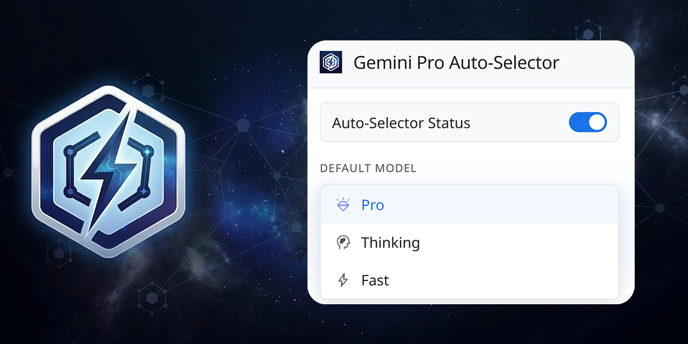
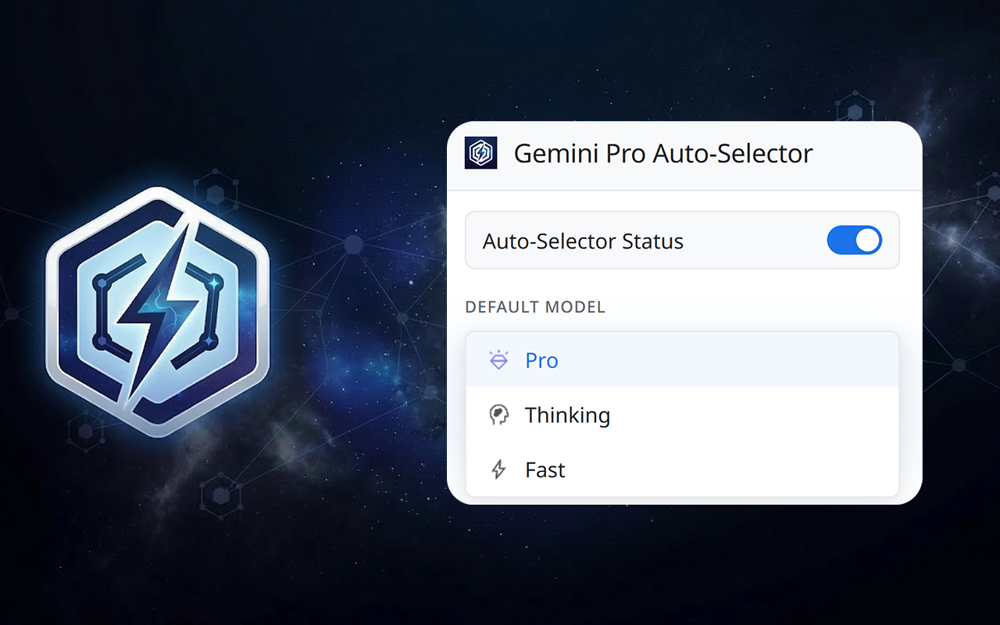
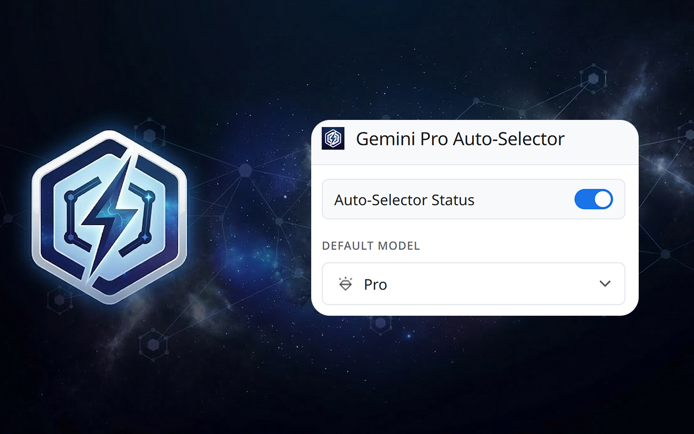

# Gemini Pro Auto-Selector

[](https://github.com/yarden-carmi/Gemini-Pro-Auto-Selector/releases)
[](LICENSE)
[](https://chromewebstore.google.com/detail/dlodbmpajmgenlgncfjmlpcomibkioma?utm_source=item-share-cb)
[](https://addons.mozilla.org/en-US/firefox/addon/gemini-pro-auto-selector/)

A browser extension that automatically selects your preferred model on [Google Gemini](https://gemini.google.com). When your preferred model hits its usage quota, it falls back gracefully to the next best available option — without any action from you.

---



<a href="https://chromewebstore.google.com/detail/dlodbmpajmgenlgncfjmlpcomibkioma?utm_source=item-share-cb">
  
  Chrome Web Store
</a>
&nbsp;&nbsp;
<a href="https://addons.mozilla.org/en-US/firefox/addon/gemini-pro-auto-selector/">
  
  Firefox Add-ons
</a>

---

## How it works

On every Gemini page load and navigation, the extension reads the active model from the interface and compares it against your saved preference. If they differ — or if a rate-limit banner is detected — it opens the model switcher and selects the best available option from a configurable priority list (`Pro → Thinking → Fast` by default).

Once you manually interact with the model switcher yourself, the extension backs off for the rest of the session.

## Features

- **Auto-selection** — Switches to your preferred model immediately on page load.
- **Quota detection** — Reads rate-limit banners and skips limited models automatically.
- **Smart fallback** — Walks a priority list to always pick the best available model.
- **Manual override** — Detects user interaction and defers until the next page load.
- **Real-time settings** — Changes from the popup apply instantly without a page reload.
- **SPA-aware** — Handles Gemini's client-side navigation correctly.
- **No data collection** — All settings are stored locally via `chrome.storage.sync`.

## Screenshots

| Model Switching Popup Interface | Popup Interface |
| :---: | :---: |
|  |  |

## Installation

**From the browser store (recommended)**

<a href="https://chromewebstore.google.com/detail/dlodbmpajmgenlgncfjmlpcomibkioma?utm_source=item-share-cb">
  
  Chrome Web Store
</a>
&nbsp;&nbsp;
<a href="https://addons.mozilla.org/en-US/firefox/addon/gemini-pro-auto-selector/">
  
  Firefox Add-ons
</a>

**From source**

1. Clone the repository:
   ```bash
   git clone https://github.com/yarden-carmi/Gemini-Pro-Auto-Selector.git
   ```
2. Open your browser's extension page:
   - Chrome: `chrome://extensions/`
   - Firefox: `about:debugging#/runtime/this-firefox`
3. Enable **Developer Mode**.
4. Click **Load unpacked** (Chrome) or **Load Temporary Add-on** (Firefox) and select the `Extension` folder.

## Usage

Click the extension icon in your toolbar to open the popup. From there you can:

- **Enable or disable** the auto-switcher.
- **Set your preferred model**: Pro, Thinking, or Fast.

The extension will keep Gemini on your selection and fall back automatically when a model is unavailable.

## Contributing

Issues and pull requests are welcome. See [CONTRIBUTING.md](CONTRIBUTING.md) for details.

## License

[MIT](LICENSE) — © 2026 [yarden carmi](https://github.com/yarden-carmi)
